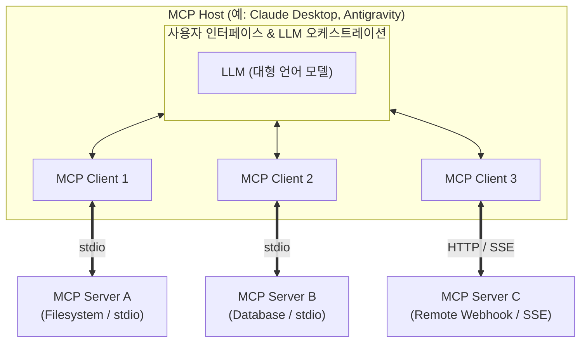
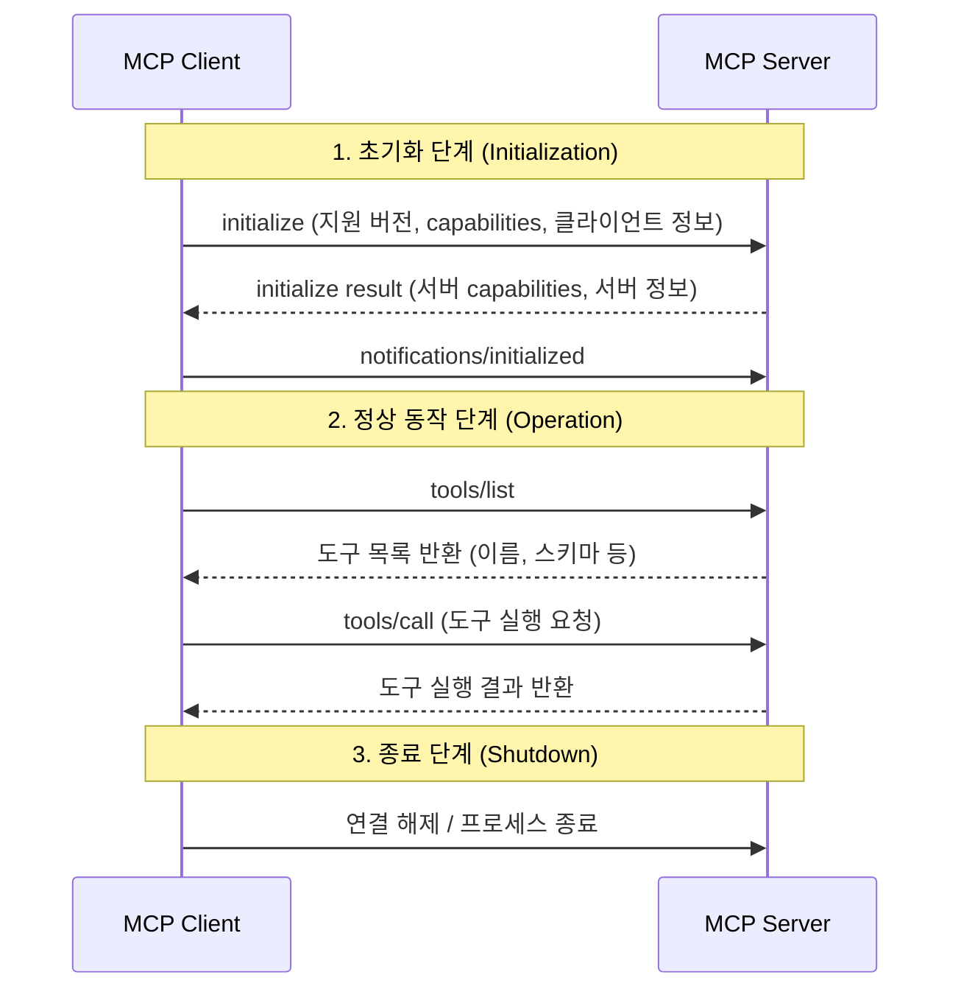

# 02. MCP 아키텍처 및 통신 프로토콜

## 1. 아키텍처 구성 요소

MCP는 명확히 분리된 **Host - Client - Server** 계층 구조를 갖습니다.



1. **Host (호스트)**:
   - 사용자가 직접 대화하는 AI 애플리케이션입니다.
   - LLM 모델 선택, 대화 컨텍스트 관리, 사용자 권한 승인(UI 프롬프트)을 총괄합니다.
   - 필요에 따라 여러 개의 MCP Client를 생성하여 다수의 MCP Server와 연결합니다.
2. **Client (클라이언트)**:
   - 각 Server와 1:1 연결을 유지하며 프로토콜 준수 여부를 검증하고 요청/응답을 중계합니다.
3. **Server (서버)**:
   - 자신이 제공할 도구(Tools), 자료(Resources), 프롬프트(Prompts)를 등록하고 클라이언트의 호출에 응답하는 경량 프로그램입니다.

---

## 2. 통신 프로토콜: JSON-RPC 2.0

MCP의 모든 메시지는 **JSON-RPC 2.0** 표준 형식을 따릅니다.

### (1) Request (요청)
클라이언트나 서버가 상대방에게 특정 작업을 요구할 때 보냅니다. 반드시 `id` 필드가 포함됩니다.

```json
{
  "jsonrpc": "2.0",
  "id": 1,
  "method": "tools/call",
  "params": {
    "name": "calculate_tax",
    "arguments": {
      "income": 50000,
      "rate": 0.15
    }
  }
}
```

### (2) Response (응답)
요청에 대한 결과 또는 에러를 반환합니다. 요청의 `id`와 일치해야 합니다.

```json
{
  "jsonrpc": "2.0",
  "id": 1,
  "result": {
    "content": [
      {
        "type": "text",
        "text": "계산된 세금은 7,500원입니다."
      }
    ]
  }
}
```

### (3) Notification (단방향 알림)
응답을 기대하지 않는 단방향 메시지로, `id` 필드가 없습니다. 주로 상태 변화나 로깅에 사용됩니다.

```json
{
  "jsonrpc": "2.0",
  "method": "notifications/resources/updated",
  "params": {
    "uri": "file:///workspace/logs/app.log"
  }
}
```

---

## 3. 전송 계층 (Transport Layer)

MCP는 전송 방식과 비즈니스 로직을 완벽히 분리했습니다. 지원되는 2가지 전송 방식은 다음과 같습니다.

### 1) Stdio Transport (표준 입출력)
- **사용 환경**: 로컬 환경에서 가장 널리 쓰이는 방식.
- **동작 원리**: Host 프로세스가 Server 프로세스를 자식 프로세스(Subprocess)로 실행하고, `stdin`과 `stdout` 파이프로 JSON-RPC 메시지를 개행 문자(`\n`)로 구분하여 교환합니다.
- **장점**: 별도의 포트 개방이나 네트워크 설정이 필요 없고, 권한 격리가 간편하며 속도가 빠릅니다.
- **주의점**: 서버가 디버깅용 `print()`나 `console.log()`를 표준 출력(`stdout`)으로 내보내면 프로토콜 메시지가 깨집니다! (로그는 반드시 `stderr`로 출력해야 함)

### 2) HTTP with SSE Transport (Server-Sent Events)
- **사용 환경**: 원격 서버, 마이크로서비스, 클라우드 호스팅 환경.
- **동작 원리**:
  - 클라이언트 $\rightarrow$ 서버: 일반 HTTP `POST` 요청으로 JSON-RPC 전송
  - 서버 $\rightarrow$ 클라이언트: HTTP `SSE (Server-Sent Events)` 스트림 연결을 통해 실시간 푸시
- **장점**: 분산 환경에서 동작 가능, 방화벽 통과 용이.

---

## 4. MCP 연결 수명 주기 (Lifecycle)



1. **초기화 (Initialize)**:
   - 프로토콜 버전 및 양측이 지원하는 기능(Capabilities: resources, prompts, tools, logging 등)을 상호 교환하고 협상합니다.
2. **동작 (Operation)**:
   - 목록 조회(`*/list`), 데이터 조회(`resources/read`), 도구 실행(`tools/call`) 등을 수행합니다.
3. **종료 (Shutdown)**:
   - 프로세스 종료 신호(SIGTERM 등)를 보내거나 스트림을 닫아 안전하게 리소스를 회수합니다.
