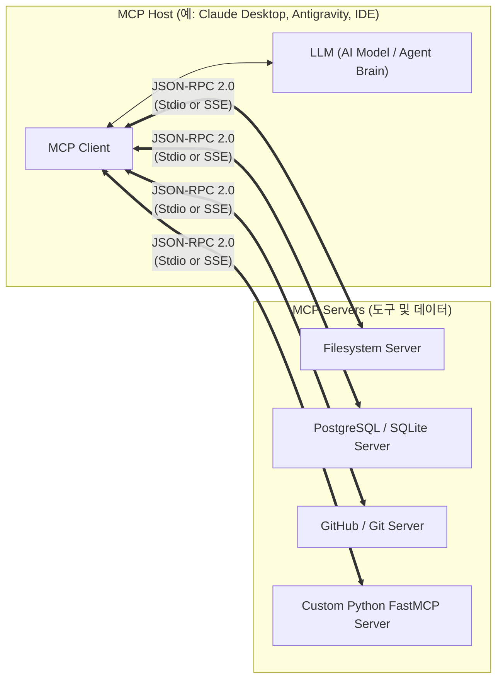

# 🚀 Model Context Protocol (MCP) 학습 저장소

Model Context Protocol(MCP)은 AI 모델(LLM)과 다양한 외부 데이터 소스 및 도구를 안전하고 표준화된 방식으로 연결하기 위한 **개방형 표준 프로토콜(Open Standard Protocol)**입니다.

Anthropic에서 2024년 11월에 오픈소스로 발표하였으며, AI 생태계의 **"USB-C 포트"** 역할을 목표로 급속히 확산되고 있습니다.

---

## 📁 저장소 구조

```text
MCP-Study/
├── README.md                      # 학습 저장소 개요 및 목차 (현재 파일)
├── .gitignore                     # Git 제외 설정 (가상환경, 임시파일 등)
├── docs/                          # 📖 핵심 이론 및 아키텍처 학습 문서
│   ├── 01_introduction.md         # MCP 개념, 배경 및 M×N 문제 해결
│   ├── 02_architecture.md         # 아키텍처 (Host-Client-Server), JSON-RPC 2.0, 전송 계층
│   ├── 03_core_primitives.md      # 3대 핵심 프리미티브 (Resources, Prompts, Tools)
│   ├── 04_agent_vs_mcp.md         # AI 에이전트(Agent) vs MCP 차이점 및 협업 관계
│   └── 05_client_integration.md   # Claude Desktop, Cursor 등 연동 및 보안 수칙
└── examples/                      # 🧪 실습 코드 및 프로젝트
    └── python-fastmcp/            # FastMCP 기반 Python 서버 실습
        ├── README.md              # 실습 튜토리얼 및 Inspector 디버깅 가이드
        ├── server.py              # 실행 가능한 FastMCP 서버 샘플 코드
        └── requirements.txt       # 의존성 패키지 목록
```

---

## 📚 학습 커리큘럼 및 목차

| 번호 | 문서 | 주요 내용 |
| :---: | :--- | :--- |
| **01** | [01. MCP 소개](./docs/01_introduction.md) | MCP란 무엇인가? 등장 배경, $M \times N$ 복잡도 해결, 핵심 가치 |
| **02** | [02. 아키텍처 & 프로토콜](./docs/02_architecture.md) | Host-Client-Server 3계층 구조, JSON-RPC 2.0, Stdio 및 SSE 전송 방식 |
| **03** | [03. 3대 핵심 프리미티브](./docs/03_core_primitives.md) | **Resources**(데이터 읽기), **Prompts**(템플릿), **Tools**(도구 실행) |
| **04** | [04. AI 에이전트 vs MCP](./docs/04_agent_vs_mcp.md) | "MCP가 곧 에이전트인가?" 아이언맨 비유, 주체성과 역할 분담 완벽 정리 |
| **05** | [05. 클라이언트 연동 & 보안](./docs/05_client_integration.md) | Claude Desktop, Cursor 연동 설정, Stdout 오염 방지 등 필수 보안 수칙 |
| **실습** | [Python FastMCP 실습](./examples/python-fastmcp/README.md) | 나만의 서버 작성, MCP Inspector로 웹 기반 도구/리소스 시각적 테스트 |

---

## 💡 한눈에 보는 MCP 구조



---

## 🛠️ 실습 빠른 시작 (Quick Start)

```bash
# 1. 실습 디렉토리로 이동
cd examples/python-fastmcp

# 2. 가상환경 생성 및 패키지 설치
python3 -m venv .venv
source .venv/bin/activate
pip install -r requirements.txt

# 3. MCP Inspector로 시각적 디버깅 실행
npx @modelcontextprotocol/inspector python3 server.py
```
