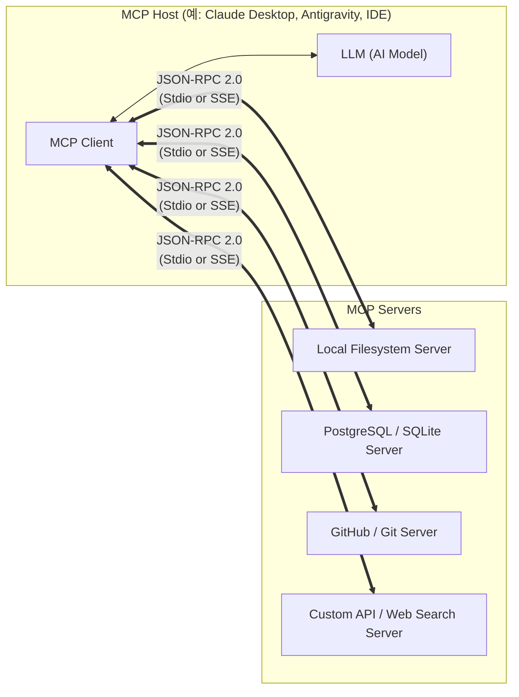

# 🚀 Model Context Protocol (MCP) 학습 가이드

Model Context Protocol(MCP)은 LLM(대형 언어 모델) 애플리케이션과 외부 데이터 소스 및 도구를 안전하고 표준화된 방식으로 연결하기 위한 **개방형 표준 프로토콜(Open Standard)**입니다.

Anthropic에서 2024년 11월에 오픈소스로 발표하였으며, AI 생태계의 **"USB-C 포트"** 역할을 목표로 급속히 확산되고 있습니다.

---

## 📚 학습 커리큘럼 및 목차

| 번호 | 문서 | 주요 내용 |
| :--- | :--- | :--- |
| **01** | [01_introduction.md](./01_introduction.md) | MCP란 무엇인가? 등장 배경, $M \times N$ 문제 해결, 핵심 가치 |
| **02** | [02_architecture.md](./02_architecture.md) | MCP 아키텍처 (Host, Client, Server), 수명 주기, 전송 계층(Stdio, SSE), JSON-RPC 2.0 |
| **03** | [03_core_primitives.md](./03_core_primitives.md) | 3대 핵심 요소: **Resources**, **Prompts**, **Tools** 및 추가 기능(Sampling, Roots) |
| **04** | [04_hands_on_python.md](./04_hands_on_python.md) | Python `FastMCP`를 활용한 실습: 나만의 MCP 서버 개발 및 MCP Inspector 디버깅 |
| **05** | [05_client_integration.md](./05_client_integration.md) | Claude Desktop, Antigravity, Cursor 등 클라이언트 연동 설정 및 보안 가이드 |

---

## 💡 한눈에 보는 MCP 구조

---

## 🛠️ 실습 전 준비 사항

- **Python 3.10 이상** 또는 **Node.js 18 이상**
- 패키지 매니저: Python의 경우 `uv` 권장 (또는 `pip`/`venv`), Node.js의 경우 `npm`/`pnpm`
- MCP 공식 문서: [https://modelcontextprotocol.io](https://modelcontextprotocol.io)
- 공식 GitHub: [https://github.com/modelcontextprotocol](https://github.com/modelcontextprotocol)
