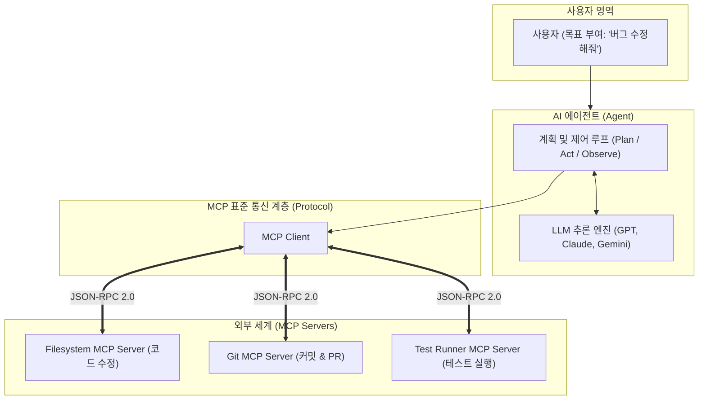

# 04. AI 에이전트(Agent) vs MCP (Model Context Protocol)

많은 개발자들이 MCP를 처음 접할 때 가장 많이 하는 질문 중 하나는 바로 **"그럼 MCP가 곧 AI 에이전트라는 뜻인가요?"**입니다.

결론부터 말하면 **둘은 전혀 다른 개념이지만, 현대의 AI 에이전트가 완성되기 위해 반드시 함께 동작하는 파트너**입니다.

---

## 1. 한눈에 보는 핵심 비유: 아이언맨

| 구분 | 개념 | 아이언맨 비유 | 실제 역할 |
| :--- | :--- | :--- | :--- |
| **AI 에이전트 (Agent)** | 자율적 의사결정 시스템 | **아이언맨 (토니 스타크 + 자비스)** | 목표를 설정하고, 상황을 분석하여 다음에 무엇을 할지 **판단하고 실행하는 두뇌** |
| **MCP (Protocol)** | 표준 인터페이스 규약 | **수트의 무기/장비 장착용 표준 슬롯** | 에이전트가 필요할 때 레이저든 부스터든 손쉽게 꽂아 쓸 수 있게 해주는 **연결 규격** |

- **에이전트**는 스스로 생각합니다: *"적의 방어막이 두꺼우니 이번엔 고출력 레이저를 쏴야겠군!"*
- **MCP**는 스스로 생각하지 않습니다: *"나한테 레이저 발사 도구가 준비되어 있어. 규격에 맞게 쏴달라고 요청하면 발사해줄게."*

---

## 2. AI 에이전트(Agent)란 무엇인가?

AI 에이전트는 단순한 '질의응답 챗봇'을 넘어서, **주어진 목표(Goal)를 달성하기 위해 자율적으로 생각하고 행동하는 시스템**입니다.

에이전트는 보통 다음과 같은 **자율 루프(Agentic Loop)**를 돕니다:
1. **Plan (계획)**: 사용자 요구사항을 분석하고 단계별 계획 수립
2. **Act (행동)**: 필요한 도구(Tool)를 선택하여 실행
3. **Observe (관찰)**: 도구 실행 결과를 확인하고 성공/실패 여부 평가
4. **Reflect / Iterate (반복)**: 목표가 달성될 때까지 다음 행동을 결정하거나 계획 수정

> **대표적인 에이전트/프레임워크**: AutoGen, CrewAI, LangGraph, Devin, Antigravity Agent

---

## 3. MCP(Model Context Protocol)란 무엇인가?

MCP는 에이전트가 위 2단계(Act)에서 외부 세상과 소통할 때 사용하는 **"통신 규약(Protocol)"이자 "도구 상자 인터페이스"**입니다.

- 에이전트가 파일 시스템을 읽거나, SQL DB를 조회하거나, 깃허브 PR을 올릴 때, 각 서비스마다 제각각인 API를 직접 공부할 필요 없이 **MCP라는 표준화된 포맷(JSON-RPC 2.0)**으로 일관되게 요청합니다.
- MCP 자체는 목표도 없고, 의사결정도 하지 않는 **수동적인 서버/프로토콜**입니다.

---

## 4. 둘의 협업 구조 (아키텍처)

1. 사용자가 에이전트에게 큰 목표를 부여합니다.
2. **에이전트(두뇌)**가 판단하여 "코드 파일을 읽어야겠다"고 결정합니다.
3. 에이전트가 **MCP 규격**을 통해 Filesystem 서버를 호출합니다.
4. MCP 서버가 결과를 에이전트에게 돌려주면, 에이전트가 결과를 보고 다음 판단을 이어갑니다.

---

## 5. 왜 사람들이 "MCP = 에이전트"라고 오해할까요?

과거의 LLM은 브라우저 밖으로 손을 뻗지 못하는 단순 말동무(챗봇)였습니다.  
그런데 **MCP라는 표준 도구를 쥐어주자마자, 비로소 컴퓨터를 제어하고 일을 스스로 끝마치는 '에이전트'로 진화**했기 때문입니다.

즉:
* **기존**: 말만 잘하는 AI 모델 (뇌만 존재)
* **AI 모델 + MCP 도구 상자** = **비로소 일하는 AI 에이전트 탄생!**

---

## 6. 비교 요약표

| 비교 항목 | AI 에이전트 (Agent) | Model Context Protocol (MCP) |
| :--- | :--- | :--- |
| **본질** | 자율적인 소프트웨어 시스템 / 문제 해결 주체 | 데이터 및 도구를 연결하는 통신 규약 / 인터페이스 |
| **의사결정권** | **보유** (무엇을 할지 스스로 판단) | **없음** (요청받은 명령을 그대로 수행) |
| **상태 유지** | 작업 목표와 진행 상태를 기억하고 관리 | 기본적으로 Stateless (요청/응답 기반) |
| **비유** | 건축가 / 기술자 | 규격화된 전동 공구 세트 (표준 플러그) |
| **주요 역할** | 문제 해결, 계획 수립, 결과 검증 | 파일 읽기, DB 쿼리, API 호출 등 기능 노출 |
